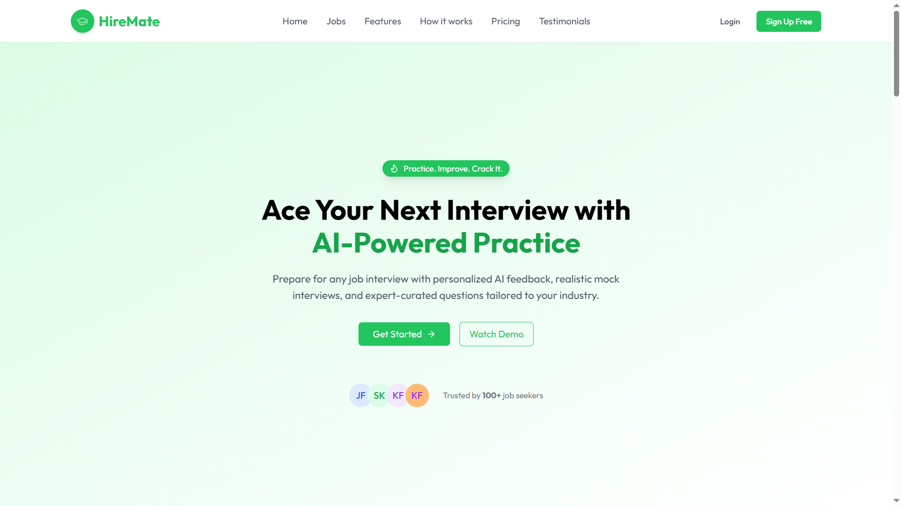

# 🚀 HireMate

**HireMate** is an AI-powered full-stack web application designed to help users prepare for job interviews through realistic mock sessions. It features AI interviewers tailored to job roles, progress tracking, and detailed post-interview feedback — all in one place.

## 🌐 Live Demo

<a href='https://hiremate-by-karan.vercel.app'> 
    
    </img>
</a>

---

## ✨ Features

- 🔐 **Advanced Authentication** with OTP verification  
- 🧠 **AI-Powered Voice Interviews** using VAPI Agent  
- 📊 **Detailed Interview Feedback** with scoring and suggestions  
- 🛠️ **Admin Dashboard** to manage job listings (Add / Update / Delete)

---

## 💻 Tech Stack

**Framework:** Next.js  
**Styling:** Tailwind CSS  
**Database:** MongoDB  
**AI Integration:** VAPI AI, OpenAI  
**Cloud Service:** Cloudinary


---

## ⚙️ Installation

### 1. Clone the repository

```bash
git clone https://github.com/KaranSinghBhandari0/HireMate_Next.js.git
cd hiremate
npm install
npm run dev

```

⚙️ Environment Variables
---
To run this project, you will need to add the following environment variables to your .env files

```
MONGO_URL=your_mongodb_connection_string

JWT_SECRET=your_jwt_secret

CLOUD_NAME=your_cloudinary_cloud_name

API_KEY=your_cloudinary_api_key

API_SECRET=your_cloudinary_api_secret

ADMIN_ID=admin_id

MAIL_USER=your_email_address

MAIL_PASS=your_email_password

NEXT_PUBLIC_OPENROUTER_API_KEY=your_OpenAI_key

NEXT_PUBLIC_VAPI_API_KEY=your_VAPI_key